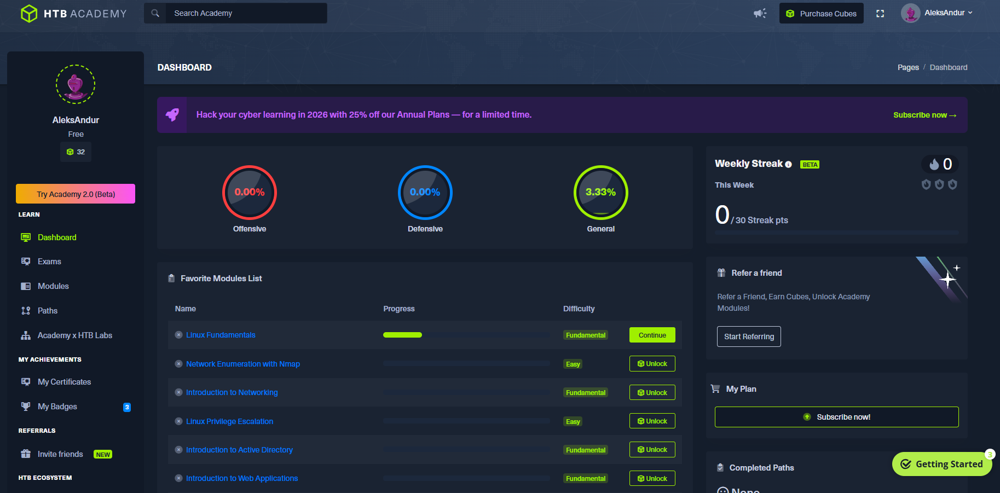

# **HTB - WORKSHOP**

Slides voor HTB workshop van het IT-lab

---
# Hack The Box

 

---

# Meevolgen op:

https://hogent-it-lab.github.io/HTB-workshop/slides <!-- URL naar de slides -->

---

# Wat is Hack The Box?

- Platform voor het oefenen van **hacking** en related skills
- Hoofdzakelijk **red teaming** (*offensive*) en pentesting
- HTB Academy voor leerpaden, HTB Labs voor praktische toepassing
- **Gamification!!**

---

# Gamification en community

---

# Waarom Hack The Box?

- Handig en veelgebruikt platform
- "Boxes" van verschillende niveau's en topics
- Heel wat resources in de community
- Veel features zijn gratis!

---

# Werken met Hack The Box

---

# Werken met Hack The Box

- Account aanmaken voor HTB-labs
- HTB-Academy bekijken
- HTB-Labs uitvoeren
- Gebruik een Linux-systeem!!

---

# Systeem en tools - Linux

- Eender welke distributie naar keuze
- Distro's zoals Kali Linux bevatten al veel tools
- Je kan je systeem uiteraard customizen en tweaken
- Ubuntu Desktop is ook een prima startpunt

---

# Account aanmaken

- HTB account aanmaken op de officiële website
- Kies jouw tag zorgvuldig!!
- Hou je wachtwoord zeker bij (password manager!)

---

# HTB-Academy

---

# HTB-Labs - onderdelen

- Challenges: kleinere uitdagingen (soms wel complex!)
- Machines: "boxes" om te proberen kraken
- Sherlocks: challenge gecentreerd rond een specifieke cyber attack

---

# HTB-Labs - Challenges

- SpookyPass
- Flag Command
- Spookifier (geavanceerder!)

---

# HTB-Labs - Machines

- Boxes die je probeert te kraken (flags!)
- Divers in aard en moeilijkheid
- Verbinden met de machines met behulp van een VPN!

---

# HTB-Labs - VPN

- Gebruik OpenVPN bij HTB machines
- .ovpn bestand downloaden
- OpenVPN gebruiken met de CLI (Linux)
- Desktop VPN-client voor OpenVPN op Windows (afgeraden)

---

# Voorbeeld Machine - Cap

- 'Spawn' de machine in
- Gebruik de OpenVPN verbinding
- Probeer te pingen naar het IP-adres van het toestel
- Bekijk de webserver
- Hack away!!

---

# Write-ups

- Samenvatting na het kraken van een machine
- Online te vinden voor veel bestaande boxes
- Kan je zelf ook schrijven (in markdown) en online posten
- Niet spieken!!

---

# Happy Hacking!

- Experimenteer met het platform
- Wees niet bang om vast te geraken! 
- Begin met de basic boxes
- Zit je écht vast, spiek eens bij een write-up voor een hintje